<h1> Week 4 and 5 DigitalCrafts Full-Stack Immersive </h1>

 - Coursework on JavaScript, JSON, Firebase, and Debugging. It contains assignments, files, and 
  screenshots from week 4 and week 5.  

<h2> Summary </h2>

  - [Screenshots](#screenshots)
  - [Acknowledgments](#acknowledgments)

## Screenshots

**Week 4 Day 2 - To Do List App**

- Prompt was to create a To Do List that looked good on mobile, allowed for adding and removing tasks, and allowed the user to move an item from pending tasks to completed and vice versa.

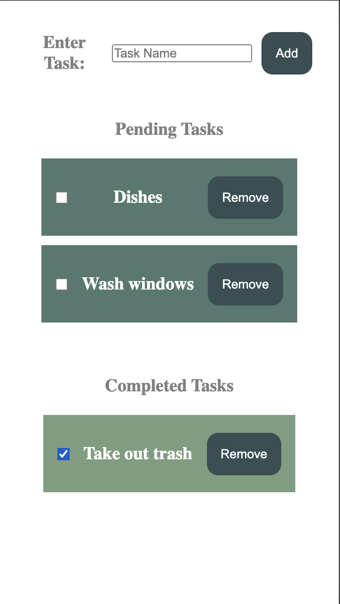

**Week 4 Day 3 - Menu App**

- Prompt was to create a responsive menu that displayed dishes from a JSON. When clicked, buttons should filter the dishes by course. I refactored it to do all of this in one function.

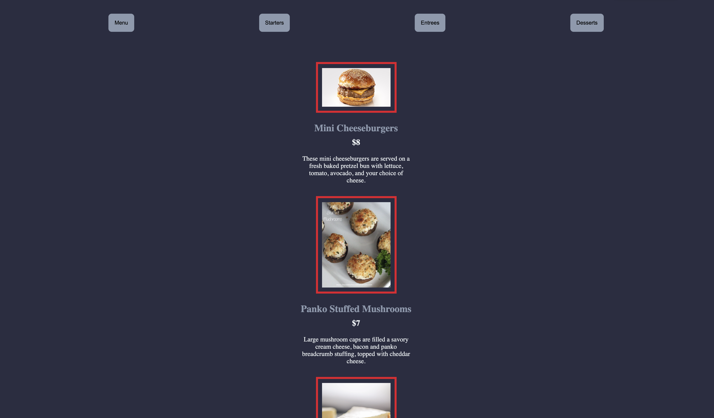

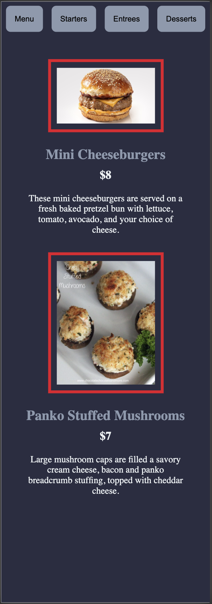

**Week 4 Day 4 - News App**

- Prompt was to display news items (author, title, despcription, source, image, and publishind date) to the user from a JSON. Create a page which displays the following information related to the news. I copleted the "harder mode" which involved displaying sources from a second JSON if they corresponded to a displayed news item. When clicked, the source should display the corresponding news items.

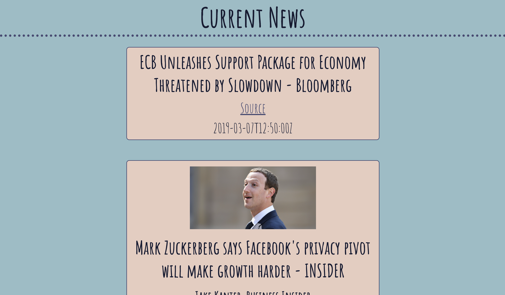

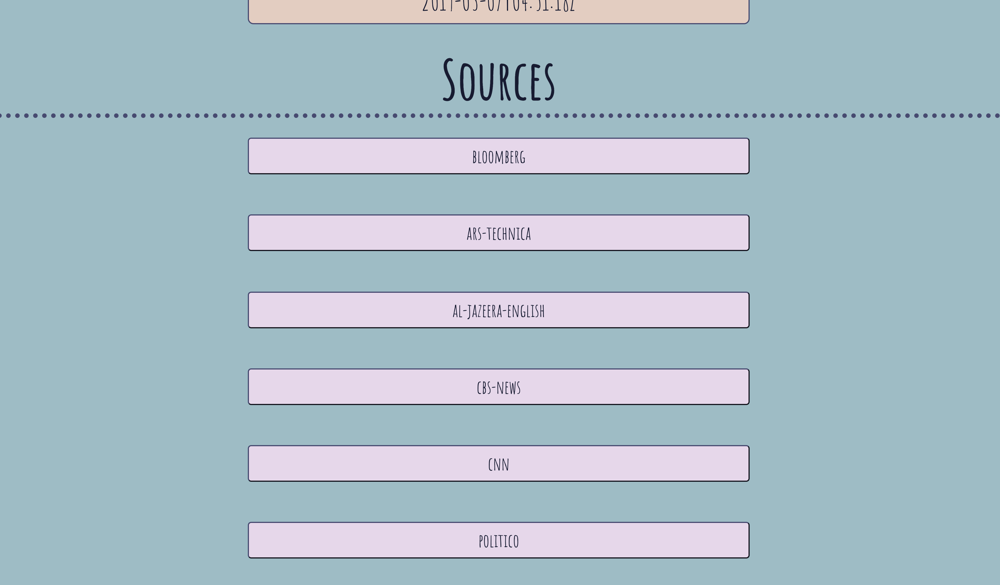

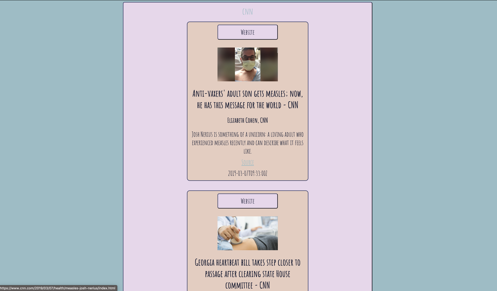

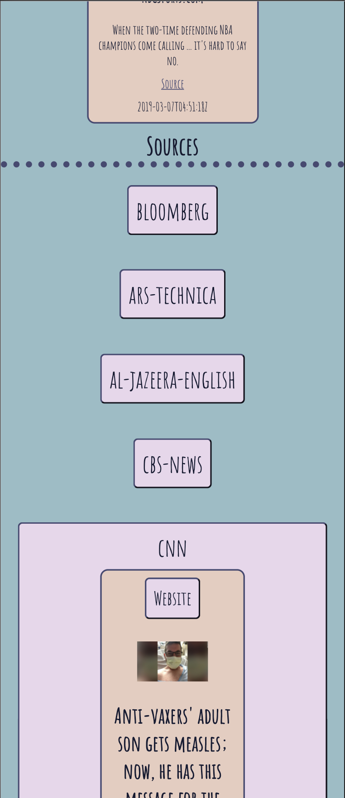

**Week 5 Day 1 - Movies App**

- Prompt was to display the Batman movies using a IMDB API call, and display the details of a movie using a second API call.

- Went back and refactored. Added a search function with a validated input box as well.

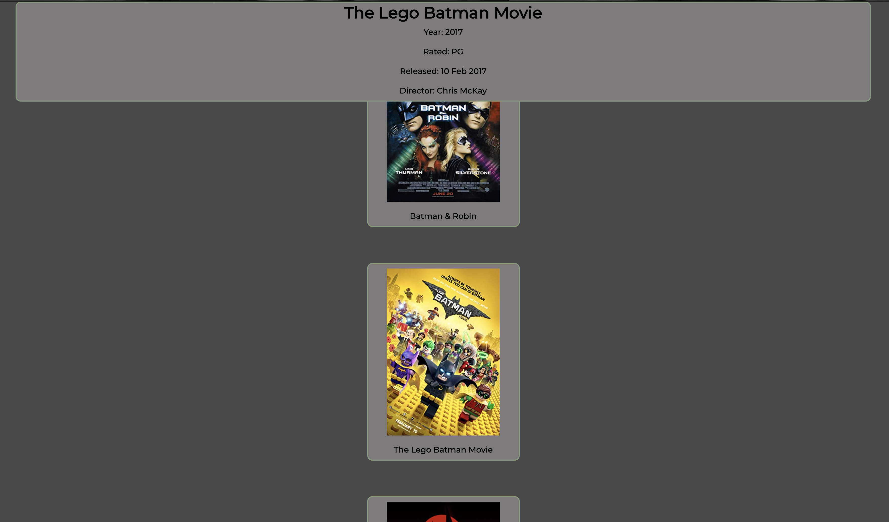

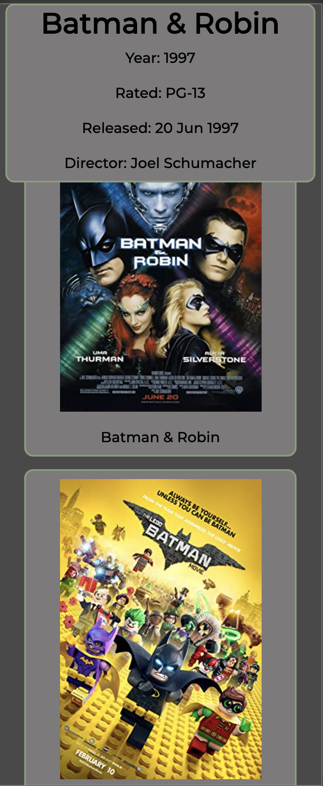

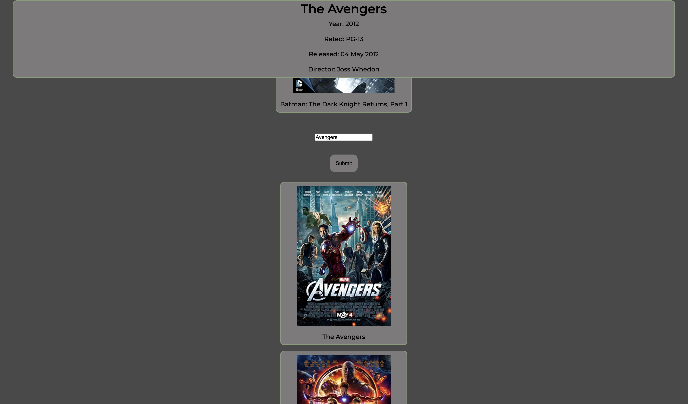

**Week 5 Day 2 - Coffee App**

- Prompt was to create an app which lists all the coffee orders from an API on a web page. The user should be able to type in the email address in a textbox and search for a particular coffee order by email address, delete the coffee order, and add a new coffee order. 

- I added form validation and 2 types of alert messages for invalid entries.

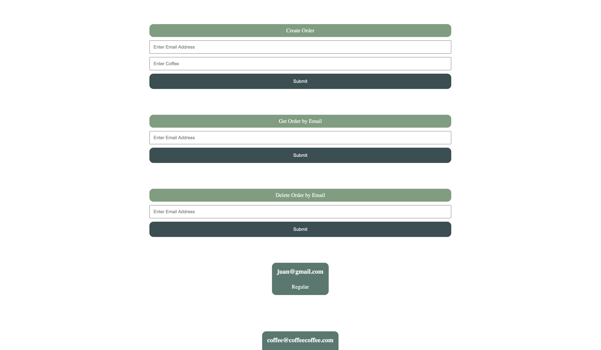

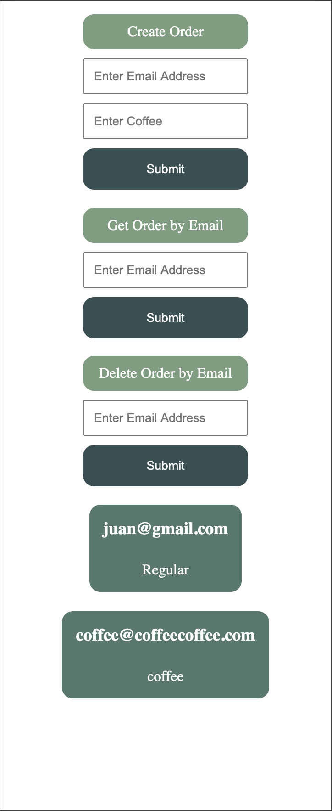

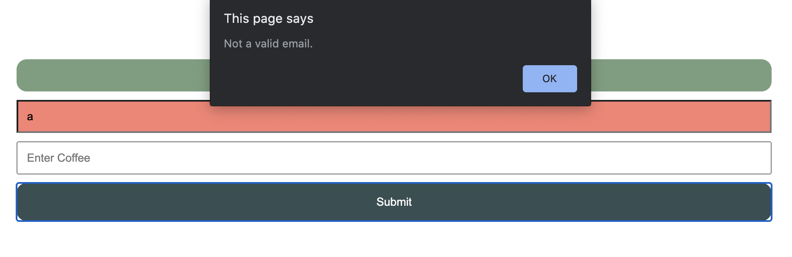

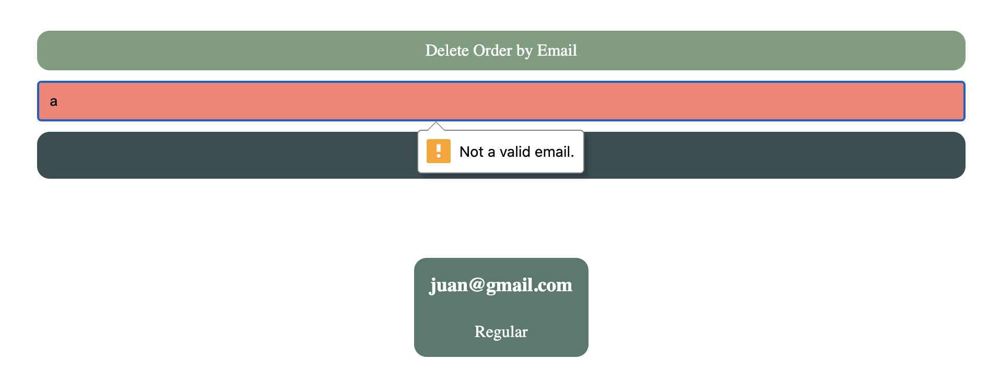

**Week 5 Day 3 - Weather App**

- Prompt was to create an app which uses the OpenWeatherMap API to get the live weather. I completed the hard mode (automatically find the coordinates of the user and use that to fetch the weather information based on the current location of the user.) As well as adding a button that will convert the temperature units from Fahrenheit to Celsius and vice versa.

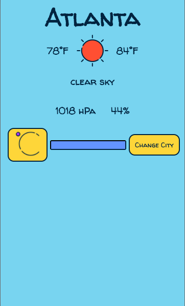

**Week 5 Day 4 - Grocery Firebase App**

- Prompt was to create a grocery list app which allows you to add different categories (store name and address), view all grocery categories, and delete grocery categories with Firebase. Hard mode was to add items to the grocery categories. I added the option to display all items.

## Acknowledgments

  - **Billie Thompson** - *Provided README Template* -
    [PurpleBooth](https://github.com/PurpleBooth)
  - **Nathan Orris** - *The Certified* - **DiR at DigitalCrafts Houston** -
    [NathanNoSudo](https://github.com/NathanNoSudo)

